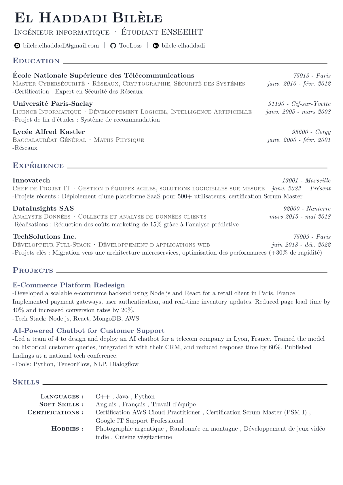
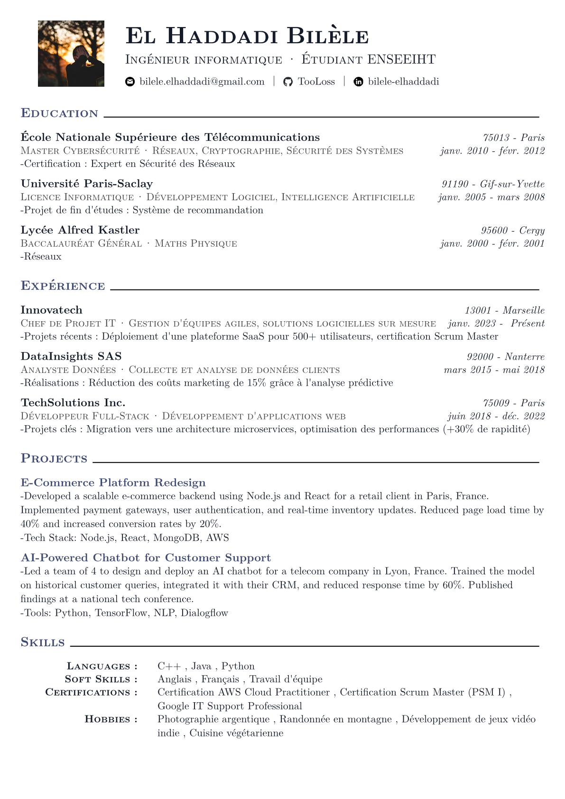

# Typst Resume Template

A clean, modern resume template written in **Typst**. Two variants included for flexibility. Can be modified easily.

## Features
- **Minimalist design**: Focus on content, not clutter.
- **Two variants**: Choose the style that fits your needs.
- **Easy customization**: Edit text, colors, and layout in Typst.

## Preview




## Variants
There is a variant with and without pictures depending on the country you live in.

## Main Functions
The template uses the following key functions to structure your resume:

1. **`#show: resume.with(gparams: ...)`**
   Sets global parameters (name, contact, photo, etc.).

2. **`#new_section("Section Name")`**
   Creates a new section (e.g., "Education", "Experience").

3. **`#new_infos("Institution/Company", ("Title", "Specialization"), "Location", (Start Month, "Start Year"), (End Month, "End Year"), ("Details",))`**
   Adds an entry for **Education** or **Experience**.

4. **`#new_project("Project Name", ("Description + results", "Tools/Tech Stack"))`**
   Adds a project to the **Projects** section.

5. **`#new_skill("Category:", ("Skill 1", "Skill 2", ...))`**
   Adds skills to the **Skills** section.

---

## **How to Customize**

### **1. Personal Information**
Edit the `#show: resume.with(gparams: ...)` block:
```typst
#show: resume.with(
  gparams: (
    firstname: "Your First Name",
    lastname: "Your Last Name",
    lang: "en", // or "fr"
    position: ("Your Job Title", "Your Current Status/Company"),
    picture: image("Assets/your-photo.jpg", width: 100%),
    show_picture: true,
    contact: (
      (image("Assets/mail.svg"), "your.email@example.com"),
      (image("Assets/github.svg"), "your-github-username"),
      (image("Assets/linkedin.svg"), "your-linkedin-profile")
    )
  )
)
```


## Usage
1. Clone this repository.
2. Edit the `.typ` file of your chosen variant.
3. Compile with Typst:
   ```sh
   typst compile variant1.typ
   ```

## AI

Used AI to fill up random infos in the preview resume.

## License

**MIT** - Use freely, modify as needed.
